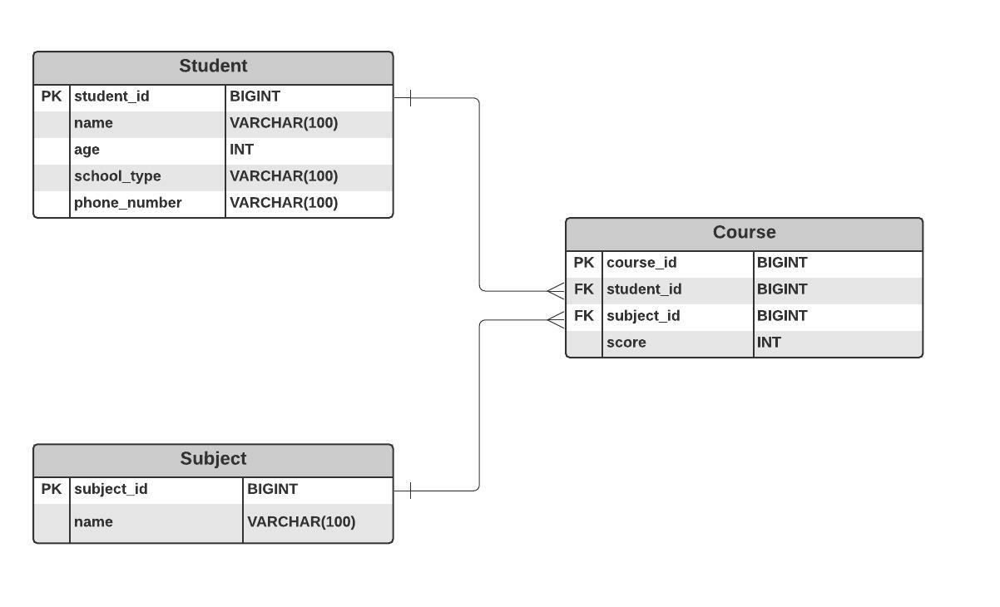

# 개발 SPEC
- JDK 1.8
- Spring Boot 2.6.2
- JPA
- Lombok
- H2 Databases
- Gradle

# 실행 방법
```
# git clone https://github.com/parkdingco/free-wheelin.git
# ./gradlew clean build 
# java -jar ./build/libs/parkdingco-0.0.1-SNAPSHOT.jar
```

# 패키지 구조
```
common - 전역으로 사용되는 클래스 집합
domain - 엔티티
exception - 커스텀 exception
service
    converter
        - 도메인 -> Response 객체 컨버팅
    validator
        - Request 객체 유효성 검증
    student
        - 학생 도메인 서비스
    subject
        - 과목 도메인 서비스
    course
        - 수강 도메인 서비스
```

# ERD



